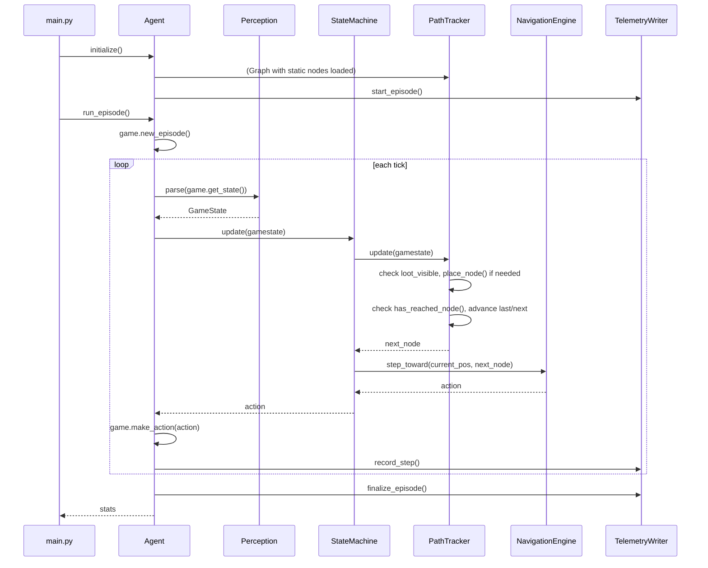

# DoomSat Runtime Architecture

## Overview

The runtime is responsible for perception, decision-making, navigation, and telemetry during a single playthrough of E1M1. It does not cover the genetic algorithm (which wraps the runtime via run_episode()), pre-processing tools like the navigation planner, or telemetry output schemas (see telemetry_tiers.md). It basically explains the different classes and the execution flow between classes.

The runtime is split into two sides with a clean boundary. The Agent side handles the episode lifecycle: initializing VizDoom, running the game loop, parsing raw game state into a GameState dataclass via Perception, and writing telemetry. Agent makes no decisions. The StateMachine side owns all decision-making: StateMachine reads GameState each tick and returns an action, delegating navigation to NavigationEngine (pure A* pathfinding and movement) and mission progress to PathTracker (node graph management, loot node placement, waypoint tracking). The boundary between the two sides is GameState flowing in and an action vector flowing out.

## Execution Flow

main.py calls agent.initialize(). Agent creates the VizDoom game object, loads config, creates Perception, creates Graph (loads static nodes from JSON, converts coords), creates NavigationEngine with Graph reference, creates PathTracker with Graph and NavigationEngine references, creates StateMachine with PathTracker and NavigationEngine references.
main.py calls agent.run_episode(). Agent calls game.new_episode(). Loop starts.
Tick fires. Agent calls perception.parse(game.get_state()) → GameState populated with health, armor, ammo, x, y, angle, kills, enemies_visible, loot_visible, damage_taken.
Agent calls state_machine.update(gamestate). StateMachine checks priority: no enemies, stats above thresholds, no damage taken → stay TRAVERSE. StateMachine calls path_tracker.update(gamestate) — PathTracker checks loot_visible, runs duplicate check, places anchor + loot nodes if needed, checks if next_node reached and advances last_node/next_node. PathTracker returns next_node. StateMachine calls navigation_engine.step_toward(current_pos, next_node) → action returned.
StateMachine returns action to Agent. Agent calls game.make_action(action). Loop continues.
game.is_episode_finished() → True. Agent calls finalize_episode(), returns stats.

## Classes
Graph
NavigationEngine
PathTracker
StateMachine
Agent
Perception
GameState
LootObject

## Class Graph:
Desc: the node graph. nodes are objects with position, type(WAYPOINT, ANCHOR, LOOT, DOOR, EXIT)
WAYPOINT is static node from JSON. ANCHOR is dynamically placed to connect to loot. DOOR and EXIT are not waypoints. LOOT uses the name field to specify loot type. Special is a raw linedef number for key doors and exits, only used in DOOR and EXIT nodes.
Fields: 
- node objects (x, y, type: NodeType, name, special(int, optional))
- edge objects
Methods:
- add_node() 
- add_edge()

## Class NavigationEngine: 
Desc:pure pathfinding and movement. Given a graph and two points, find a path. Given a current position and a target point, produce an action. Knows nothing about mission state, node types, or progress.
Fields: 
- Graph object
- door_use_timer
Methods: 
- plan_path() (do A* here, return list of nodes to traverse)
- step_toward() (angle + action to reach next node, if next node is a door, emit USE action with cooldown)

## Class PathTracker: 
Desc: mission progress and graph state. Owns the node graph. Knows which node is current, which is next, which is the goal. Decides when a node is "reached." Knows about node types (static, anchor, loot).
Fields: 
- Graph object
- NavigationEngine
- current_path
- last_node
- next_node
Methods: 
- get_next_node()
- has_reached_node()
- get_path() (call plan_path() from NavigationEngine)
- place_node()
- load_static_nodes()

## Class StateMachine:
Desc: manage what state the agent should be in, returns the agent's action
Fields: 
- enum current_state
- PathTracker 
Methods: 
- update() (a big if block for state switching, returns an action) 
- private methods for each state

## Class Agent:
Desc: manages the episode details, like the interface between VizDoom and StateMachine. Contains telemetry, perception, game initialization.
Fields: 
- VizDoom game object
- Perception 
- StateMachine
- TelemetryWriter
Methods:
- initialize() (VizDoom setup, load config, create one Graph which passes to NavigationEngine and PathTracker)
- run_episode() (calls perception + state machine each tic, returns stats for GA)
- close()

## Class Perception:
Desc: parse raw VizDoom state into a useable GameState
Fields: 
- enemy_names
- loot_names
Methods:
- parse()

## Class GameState:
Desc: dataclass holding game and agent information
Fields (focus whatever StateMachine needs to make decisions): 
- health, armor, ammo, enemies_visible, loots_visible: list[LootObject], x, y, angle, enemy_kills, is_damage_taken_since_last_step

## Class LootObject:
Desc: small dataclass for loot
Fields: name, x, y

## References:
Identifying doors and exits: https://doomwiki.org/wiki/Linedef_type
VizDoom methods: https://vizdoom.farama.org/api/python/