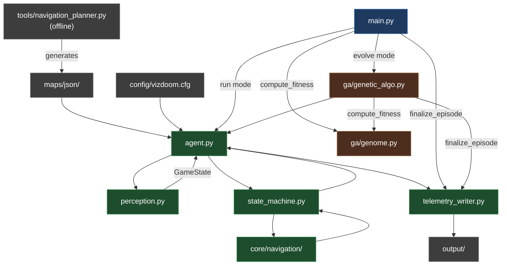

# DoomSat Runtime Architecture

## Overview

This doc explains the different runtime classes in core/ and the execution flow between classes. It does not include every method to be added, just mostly the high-level interfacing ones. These classes are responsible for perception, decision-making, navigation, and telemetry during a single playthrough of E1M1. It does not cover the genetic algorithm (which wraps the runtime via run_episode()), pre-processing tools like the navigation planner, or telemetry output schemas (see telemetry_tiers.md). 

The runtime is split into two sides with a clean boundary. The Agent side handles the episode lifecycle: initializing VizDoom, running the game loop, and parsing raw game state into a GameState dataclass via Perception. Agent makes no decisions. The StateMachine side owns all decision-making: StateMachine reads GameState each tick and returns an action, delegating navigation to NavigationEngine (pure A* pathfinding and movement) and mission progress to PathTracker (node graph management, loot node placement, waypoint tracking). The boundary between the two sides is GameState flowing in and an action vector flowing out.

In run mode, main.py drives a single episode directly through Agent. In evolve mode, main.py delegates to GeneticAlgo, which owns the Agent and manages the full evolution loop. In both modes, the runner computes fitness and calls telemetry_writer.finalize_episode() after run_episode() returns.

## Execution Flow

1. main.py calls agent.initialize_game(). Agent creates VizDoom game object, loads config, creates Graph (static nodes from JSON), creates NavigationEngine and PathTracker with Graph reference, creates StateMachine with PathTracker, creates Perception.
2. main.py calls agent.run_episode(params). Agent seeds RNG, calls game.new_episode(), opens telemetry files. Loop starts.
3. Game tick fires. Agent calls perception.parse(game.get_state()) -> GameState.
4. Agent calls state_machine.update(gamestate). StateMachine checks priority: stats above thresholds, no enemies, no damage taken -> stay in TRAVERSE state.
5. StateMachine calls path_tracker.update(game_state). PathTracker checks loot_visible, runs duplicate check, places waypoint + loot nodes if needed, advances last_node and next_node if node reached.
6. StateMachine calls path_tracker.get_next_move(current_position). PathTracker calls NavigationEngine internally -> returns action.
7. StateMachine returns action to Agent. Agent calls game.make_action(action) and telemetry_writer.record_step(). Loop continues.
8. game.is_episode_finished() -> True. Agent returns raw stats to runner.
9. Runner (main.py or GeneticAlgo) calls compute_fitness(stats) then agent.telemetry_writer.finalize_episode(stats).

**Runtime Sequence Diagram:**

```mermaid
sequenceDiagram
    participant M as main.py
    participant A as Agent
    participant P as Perception
    participant SM as StateMachine
    participant PT as PathTracker

    rect rgb(30, 58, 95)
        M->>A: initialize_game()
        A->>PT: load_static_nodes()
        M->>A: run_episode(params)
        A->>A: game.new_episode()
    end

    loop each tick
        rect rgb(30, 77, 46)
            A->>P: parse(game.get_state())
            P-->>A: GameState
            A->>SM: update(GameState)
            SM->>PT: update(GameState)
            SM->>PT: get_next_move()
            PT-->>SM: action
            SM-->>A: action
            A->>A: game.make_action(action)
        end
    end

    rect rgb(77, 46, 30)
        A-->>M: stats
        M->>M: compute_fitness(stats)
        M->>A: telemetry_writer.finalize_episode(stats)
    end
```

**File Interactions Flowchart:**

## Main Classes (there are some tiny helper classes not listed)
1. Graph
2. NavigationEngine
3. PathTracker
4. StateMachine
5. Agent
6. Perception
7. GameState

## Class Graph:
**Overview:**
- represents the node graph 
- NodeTypes are WAYPOINT, LOOT, DOOR, EXIT
- WAYPOINT is static node from JSON, DOOR and EXIT are not WAYPOINTs
- LOOT uses the name field to specify loot type. 
- Special is a raw linedef number for key doors and exits, only used in DOOR and EXIT nodes
- is_static used to distinguish nodes the agent places,important for GA fitness

**Fields:**
- node objects (x, y, type: NodeType, name, special(int, optional), is_static)
- edge objects

**Methods:**
- add_node() 
- remove_node()
- add_edge()
- remove_edge()
- get_edge()
- get_neighbors()
- identify_node()

## Class NavigationEngine: 
**Overview:**
- pure pathfinding and movement
- given a graph and two points, find a path
- given a current position and a target point, produce an action
- knows nothing about mission state, node types, or progress

**Fields:**
- Graph object

**Methods:**
- make_path() (do A* here, return list of nodes to traverse)
- step_toward() (angle + action to reach next node)

## Class PathTracker: 
**Overview:**
- mission progress and graph state
- owns the node graph
- knows which node is current, which is next, which is the goal
- decides when a node is reached
- knows about NodeTypes

**Fields:**
- Graph object
- NavigationEngine
- current_path
- last/next/goal nodes
- previous health, armor, ammo
- visited_waypoints
- door_use_timer
- blocking_segments
- is_stuck

**Methods:**
- load_static_nodes()
- update()
- get_next_move()
- set_goal_by_type()

## Class StateMachine:
**Overview:** 
- manage what state the agent should be in, returns the agent's action

**Fields:**
- PathTracker 
- state related fields and cooldowns

**Methods:** 
- update(gamestate) (if block for state switching, returns an action) 
- private methods for each state

## Class Agent:
**Overview:** 
- manages the episode details, like the interface between VizDoom and StateMachine 
- contains telemetry, perception, game initialization

**Fields:**
- VizDoom game object
- Perception
- StateMachine
- TelemetryWriter

**Methods:**
- initialize_game() (VizDoom setup, load config, create one Graph which passes to NavigationEngine and PathTracker)
- run_episode() (calls perception + state machine each tick, returns raw stats. Runner computes fitness and calls finalize_episode)
- close()

## Class Perception:
**Overview:**
- parse raw VizDoom state into a useable GameState

**Fields:**
- enemy_names
- loot_names

**Methods:**
- parse()

## Class GameState:
**Overview:**
- dataclass holding game and agent information

**Fields (what StateMachine needs to make decisions):**
- health
- armor
- ammo, 
- enemies_visible: list[EnemyObject]
- loots_visible: list[LootObject]
- position x
- position y
- angle 
- enemies_killed
- is_damage_taken_since_last_step

## References:
Identifying doors and exits: https://doomwiki.org/wiki/Linedef_type
VizDoom methods: https://vizdoom.farama.org/api/python/