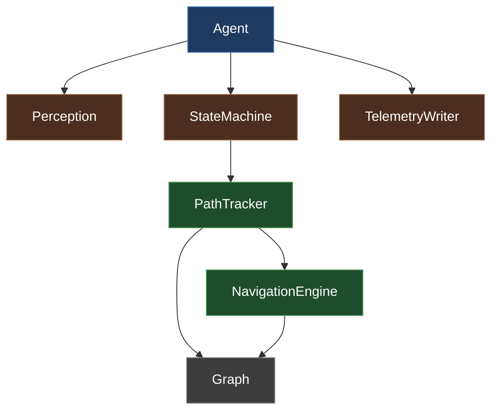

# DoomSat Class Reference

## Overview
Field and method reference for the core runtime classes. For execution flow and how these classes interact see `system_design.md`. There are some small helper classes not listed here.

## Main Classes
1. Graph
2. NavigationEngine
3. PathTracker
4. StateMachine
5. Agent
6. Perception
7. GameState

## Class Ownership

## Class Graph:
**Overview:**
- represents the node graph 
- NodeTypes are WAYPOINT, LOOT, DOOR, EXIT
- WAYPOINT is static node from JSON, DOOR and EXIT are not WAYPOINTs
- LOOT uses the name field to specify loot type. 
- Special is a raw linedef number for key doors and exits, only used in DOOR and EXIT nodes
- is_static used to distinguish nodes the agent places,important for GA fitness

**Fields:**
- node objects (x, y, type: NodeType, name, special(int, optional), is_static)
- edge objects

**Methods:**
- add_node() 
- remove_node()
- add_edge()
- remove_edge()
- get_edge()
- get_neighbors()
- identify_node()

## Class NavigationEngine: 
**Overview:**
- pure pathfinding and movement
- given a graph and two points, find a path
- given a current position and a target point, produce an action
- knows nothing about mission state, node types, or progress

**Fields:**
- Graph object

**Methods:**
- make_path() (do A* here, return list of nodes to traverse)
- step_toward() (angle + action to reach next node)

## Class PathTracker: 
**Overview:**
- mission progress and graph state
- owns the node graph
- knows which node is current, which is next, which is the goal
- decides when a node is reached
- knows about NodeTypes

**Fields:**
- Graph object
- NavigationEngine
- current_path
- last/next/goal nodes
- previous health, armor, ammo
- visited_waypoints
- door_use_timer
- blocking_segments
- is_stuck

**Methods:**
- load_static_nodes()
- update()
- get_next_move()
- set_goal_by_type()

## Class StateMachine:
**Overview:** 
- manage what state the agent should be in, returns the agent's action

**Fields:**
- PathTracker 
- state related fields and cooldowns

**Methods:** 
- update(gamestate) (if block for state switching, returns an action) 
- private methods for each state

## Class Agent:
**Overview:** 
- manages the episode details, like the interface between VizDoom and StateMachine 
- contains telemetry, perception, game initialization

**Fields:**
- VizDoom game object
- Perception
- StateMachine
- TelemetryWriter

**Methods:**
- initialize_game() (VizDoom setup, load config, create one Graph which passes to NavigationEngine and PathTracker)
- run_episode() (calls perception + state machine each tick, returns raw stats. Runner computes fitness and calls finalize_episode)
- close()

## Class Perception:
**Overview:**
- parse raw VizDoom state into a useable GameState

**Fields:**
- enemy_names
- loot_names

**Methods:**
- parse()

## Class GameState:
**Overview:**
- dataclass holding game and agent information

**Fields (what StateMachine needs to make decisions):**
- health
- armor
- ammo, 
- enemies_visible: list[EnemyObject]
- loots_visible: list[LootObject]
- position x
- position y
- angle 
- enemies_killed
- is_damage_taken_since_last_step

## References:
Identifying doors and exits: https://doomwiki.org/wiki/Linedef_type
VizDoom methods: https://vizdoom.farama.org/api/python/