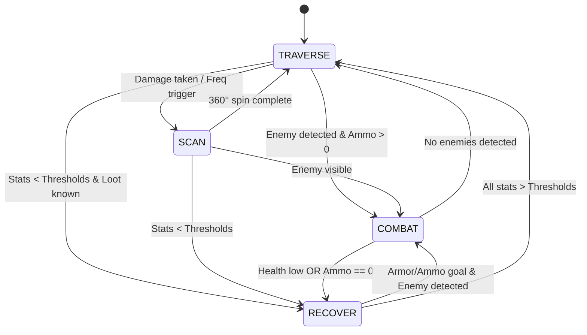

# Execution Algorithm Design

## Overview
The execution algorithm is a hierarchal state machine with tunable params that control agent behavior. This doc defines the architecture needed to beat E1M1 and its mechanics only. States have a natural hierarchy defined by their entry/exit conditions.

## Hyperparameters
- Level timeout: should scale by level, E1M1 = 4200 tics (120 seconds @ 35 tic/s)
- Hang detector: level ends if agent moves < 200 units in any 1050 tics (30 seconds)
- Minimum combat ammo: 0, ammo_threshold param controls when we look for ammo, but we don't want it to dictate when we run from a fight.

## Layer 1: Navigation Engine
- Use A* to pathfind from points A to B
- If door detected in path, execute USE action (doors defined with WADlinedef data)

## Layer 2: PathTracker
- Manages the node graph and mission progress
- Static nodes, or waypoints, define the mininal path for level completion
- Dynamic nodes get placed by the agent during playtime, these reset upon level restart
- When agent sees loot, a loot node is placed at the loot position, and an anchor node is placed at the current position
- An edge connects these two nodes, and the anchor node is inserted between two static nodes

## Layer 3: States
- High to low priority, these are like goals
- The hierarchy must be adhered to quite strictly or cycles will occur
- RECOVER is 1st and COMBAT is 2nd to prioritize survival over fighting 

1. RECOVER
2. COMBAT
3. TRAVERSE
4. SCAN (360)

**State Machine Diagram (Mermaid):**

## RECOVER
**Notes:**
- Like TRAVERSE but the goal node is loot rather than exit
- Loot is health pack, armor, ammo (high to low priority)
- Parameters determine which other states can be accessed from here 

**Entry:**
- From COMBAT or TRAVERSE or SCAN 
- if health/armor/ammo below thresholds AND respective loot nodes are known

**Behavior:**
- Every frame we evaluate priority based on agent stats (health, armor, ammo)
- Set goal node to highest priority item node
- Navigate to goal node

**Exit:**
- If seeking health: no exit, highest priority
- Then if seeking armor OR ammo, can go to COMBAT if enemy detected AND ammo > 0
- Then if all stats above threshold, go to TRAVERSE

## COMBAT
**Notes:**
- Only overriden by RECOVER if health or armor stats drop below threshold

**Entry:**
- From RECOVER or TRAVERSE or SCAN
- If enemy is detected and ammo > 0

**Behavior:**
- Mechanics are aim, fire, and strafe

**Exit:**
- Go to RECOVER if health < health_threshold OR ammo = 0
- Go to TRAVERSE if no more enemies detected

## TRAVERSE:
**Notes:**:
- The default state, goal is level exit node

**Entry**:
- Default state at level start
- From RECOVER if stats above thresholds
- From COMBAT if no enemies
- From SCAN after completing a scan with no interruptions

**Behavior:**
- Set goal node to the level exit
- Navigate to the goal node

**Exit:**
- Go to RECOVER if stats drop below thresholds
- Go to COMBAT if enemy visible
- Go to SCAN (if not on cooldown) if damage taken or SCAN chance activated

## SCAN:
**Notes:**
- Only available from TRAVERSE since we want to be on the main path and not actively looking for loot
- Helps find mark loot nodes we missed and helps turn towards enemies that shoot us in the back

**Entry:**
- From TRAVERSE
- IF SCAN not on cooldown AND (damage taken OR scan_frequency param triggered)

**Behavior:**
- Perform a 360 degree spin in-place

**Exit:**
- Go to RECOVER if states drop below thresholds
- Go to COMBAT if enemy visible
- Go to TRAVERSE if 360 spin completes

## Design Decisions
**Automap Not Used:**
VizDoom provides an automap buffer showing entire level layout and object positions. We chose not to use this feature because:
- We want the agent to explore some and not have perfect map info going into the level
- Maintains realistic perception constraints
- Pre-placed waypoints + dynamic item nodes provide sufficient navigation guidance
- Don't want to write image processing code

**FOV Information:**
VizDoom provides "state.objects" which gives the agent all enemy/item positions in the entire map. We chose not to use this to prioritize learning by giving the agent minimal help. This creates more interesting evolutionary pressure (exploration vs exploitation). Testing on E1M1 showed state.objects returns 84 objects (entire level) while state.labels, which is FOV limited, returns 7 labels, confirming state.objects provides complete map knowledge. We will use state.labels to only use information available in the agent's FOV.

**Sprint Not Used:**
Sprint is a valid action. However, we are omitting it for simplicity. The main benefit of using sprint would be to complete levels faster, but it only takes 2 seconds per level currently, so this isn't a huge time-saver. The main concern is that because sprinting exaggerates the effects of the sliding mechanic, the agent would lose some control over its pathfinding and get stuck or fall more often. This needs to be tested more.

## Needs Testing:
What happens when too many dynamic anchor nodes are placed?

## Testing Results
**Units, Speed, Visibility, Labels:**
- Walking speed: 6.11 units/tic (214 units/sec)
- Sprinting speed: 12.28 units/tic (430 units/sec)
- Visibility range: at least 700 units 
- FOV-limited: state.labels only shows objects in current view
- Objects behind agent or passed by disappear from labels
- Loot pickup range: ~60 units from item

## References
- Unit size reference: https://doomwiki.org/wiki/Map_unit
- Weapons and items: https://gamefaqs.gamespot.com/ps4/270132-doom-1993/faqs/80222/weapons-and-items

## Future Work
- visual node placement tool
- Stuck state, how it could work:
    Notes: The idea is to help TRAVERSE or RECOVER pathfinding get back to the main path. Even though we might want to shoot enemies while stuck, that would introduce cycles without state tracking (this architecture does not have). Returns to TRAVERSE even if previously in RECOVER to avoid using state history, TRAVERSE will take it to RECOVER anyways if needed
    Entry: From TRAVERSE or RECOVER when stuck detection triggered (see Hyperparameters)
    Behavior undefined currently. Exit: Go to TRAVERSE when agent returned to main path
- Detour state and Breadcrumb pathfinding will allow more exploration
- Explore sprinting pros and cons