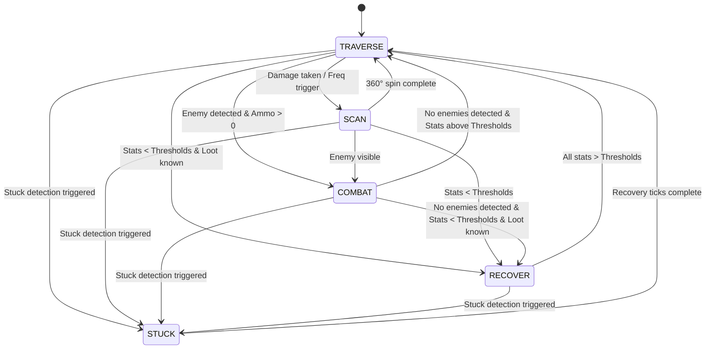

# Execution Algorithm Design

## Overview
The execution algorithm is a hierarchal state machine with tunable params that control agent behavior. This doc defines the architecture needed to beat E1M1 and its mechanics only. States have a natural hierarchy defined by their entry/exit conditions.

## Hyperparameters
- Level timeout: scales by level, up to 12600 ticks (360 seconds @ 35 tic/s)
- Stuck detection: fires if agent moves < 50 units in any 175 ticks (5 seconds)
- Stuck recovery: agent turns randomly + moves forward for 70 ticks (~2 seconds) to dislodge
- Minimum combat ammo: 0, ammo_threshold param controls when we look for ammo, but we don't want it to dictate when we run from a fight.

## Layer 1: Navigation Engine
- Use A* to pathfind from points A to B

## Layer 2: PathTracker
- Manages the node graph and mission progress
- Static nodes, or waypoints, define the mininal path for level completion
- Dynamic nodes get placed by the agent during playtime, these reset upon level restart
- When agent sees loot, a loot node is placed at the loot position, and a waypoint node is placed at the current position
- An edge connects these two nodes, and the waypoint node is inserted between two static nodes
- If door or exit detected in path, execute USE action (defined with WADlinedef data)

## Layer 3: States
- High to low priority, these are like goals
- The hierarchy must be adhered to quite strictly or cycles will occur
- STUCK is highest priority so stuck recovery always completes before other states can interrupt it
- COMBAT is above RECOVER — agent finishes the fight first, then tends to wounds. Running for loot past enemies is often more dangerous than standing and fighting.

1. STUCK
2. COMBAT
3. RECOVER
4. SCAN (360)
5. TRAVERSE

**State Machine Diagram (Mermaid):**

## STUCK
**Notes:**
- Highest priority state — interrupts everything including RECOVER and COMBAT
- Always exits to TRAVERSE regardless of prior state to avoid cycles (TRAVERSE re-evaluates and enters RECOVER if needed)
- Agent can't navigate to loot while physically stuck anyway, so interrupting RECOVER costs nothing

**Entry:**
- From any state when PathTracker stuck detection fires (agent moved < 50 units in 175 ticks)

**Behavior:**
- Randomly picks left or right turn direction once on entry, holds that direction for full duration
- Combines turn + forward every tick to physically arc around the obstacle
- Runs for STUCK_RECOVERY_TICKS (70 ticks, ~2 seconds)

**Exit:**
- Go to TRAVERSE when recovery ticks complete

## RECOVER
**Notes:**
- Like TRAVERSE but the goal node is loot rather than exit
- Loot is health pack, armor, ammo (high to low priority)
- Parameters determine which other states can be accessed from here

**Entry:**
- From COMBAT or TRAVERSE or SCAN
- if health/armor/ammo below thresholds AND respective loot nodes are known

**Behavior:**
- Every frame we evaluate priority based on agent stats (health, armor, ammo)
- Set goal node to highest priority item node
- Navigate to goal node

**Exit:**
- Go to TRAVERSE when all stats above thresholds

## COMBAT
**Notes:**
- Higher priority than RECOVER — agent finishes the fight before seeking loot
- Vertical aiming is handled by the engine (`+autoaim 35` in vizdoom.cfg), no screen-space filtering needed

**Entry:**
- From TRAVERSE, SCAN, or RECOVER
- If enemy is detected and ammo > 0

**Behavior:**
- Aims and fires at enemy

**Exit:**
- Go to RECOVER if no enemies and stats < thresholds and loot known
- Go to TRAVERSE if no enemies and stats above thresholds

## TRAVERSE:
**Notes:**:
- The default state, goal is level exit node

**Entry**:
- Default state at level start
- From RECOVER if stats above thresholds
- From COMBAT if no enemies
- From SCAN after completing a scan with no interruptions
- From STUCK when recovery ticks complete

**Behavior:**
- Set goal node to the level exit
- Navigate to the goal node

**Exit:**
- Go to STUCK if stuck detection fires
- Go to RECOVER if stats drop below thresholds
- Go to COMBAT if enemy visible
- Go to SCAN (if not on cooldown) if damage taken or SCAN chance activated

## SCAN:
**Notes:**
- Only available from TRAVERSE since we want to be on the main path and not actively looking for loot
- Helps mark loot nodes we missed and helps turn towards enemies that shoot us in the back

**Entry:**
- From SCAN (continuing), TRAVERSE
- IF SCAN not on cooldown AND (damage taken OR scan_frequency param triggered) (we don't want to scan every time we take damage because it could be from sources besides enemies like lava)

**Behavior:**
- Perform a 360 degree spin in-place

**Exit:**
- Go to STUCK if stuck detection fires
- Go to RECOVER if stats drop below thresholds
- Go to COMBAT if enemy visible
- Go to TRAVERSE if 360 spin completes

## Design Decisions
**Automap Not Used:**
VizDoom provides an automap buffer showing entire level layout and object positions. We chose not to use this feature because:
- We want the agent to explore some and not have perfect map info going into the level
- Maintains realistic perception constraints
- Pre-placed waypoints + dynamic item nodes provide sufficient navigation guidance
- Don't want to write image processing code

**FOV Information:**
VizDoom provides "state.objects" which gives the agent all enemy/item positions in the entire map. We chose not to use this to prioritize learning by giving the agent minimal help. This creates more interesting evolutionary pressure (exploration vs exploitation). Testing on E1M1 showed state.objects returns 84 objects (entire level) while state.labels, which is FOV limited, returns 7 labels, confirming state.objects provides complete map knowledge. We will use state.labels to only use information available in the agent's FOV.

**Sprint Not Used:**
Sprint is a valid action. However, we are omitting it for simplicity. The main benefit of using sprint would be to complete levels faster, but it only takes 2 seconds per level currently, so this isn't a huge time-saver. The main concern is that because sprinting exaggerates the effects of the sliding mechanic, the agent would lose some control over its pathfinding and get stuck or fall more often. This needs to be tested more.

## Testing Results
**Units, Speed, Visibility, Labels:**
- Walking speed: 6.11 units/tick (214 units/sec)
- Sprinting speed: 12.28 units/tick (430 units/sec)
- Visibility range: at least 700 units
- FOV-limited: state.labels only shows objects in current view
- Objects behind agent or passed by disappear from labels
- Loot pickup range: ~60 units from item
- game.get_state.screen_buffer.shape gives (height, width) for GRAY8 or (height, width, channels) for RGB24, VizDoom uses channels-last, so shape[1] is always width
- can damage enemies if horizontally aligned even if not vertically aligned
- VizDoom angles: 0=East, 90=North, 180=West, 270=South (tested with temporary script)

## References
- Unit size reference: https://doomwiki.org/wiki/Map_unit
- Linedef types (doors, exits) https://doomwiki.org/wiki/Linedef_type#Door_linedef_types
- Weapons and items: https://gamefaqs.gamespot.com/ps4/270132-doom-1993/faqs/80222/weapons-and-items
- For more specific item names: https://zdoom.org/w/index.php?title=Main_Page

## Future Work
- Combat blackist (if needed): if we don't kill any enemies after being in combat for a while, it means the enemy is behind some geometry and we need to stop shooting or all ammo will get wasted. Can work similarly to loot node blacklist in path_tracker.
- Move backwards during combat. A few ways to do this. Could make it a GA param. Helpful when there's an enemy with a lot of health and we need more time to kill it.
- A way to allow for more exploration. A detour state or some type of breadcrumb pathfinding could help.