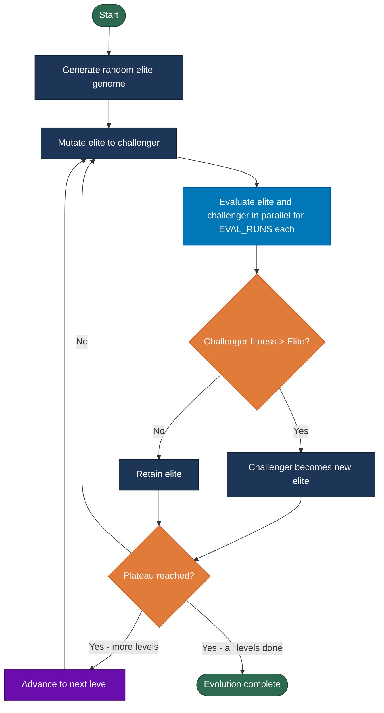

# Genetic Algorithm Design

## Overview
The DoomSat payload uses a 2-Agent Micro-Population Steady-State Elitist Genetic Algorithm (µGA) to evolve behavioral parameters for the execution algorithm. This minimal-population approach is designed for low computational overhead which is suitable for spacecraft constraints. It also guarantees non-regression because the elite is always preserved. A crossover approach for mutating params is not used because the pool of genomes is not large enough, and this wouldn't reflect the radiation bit-flip anyways. The two agent will run in parallel, see docs/ga_parallelism.md.


## Population Structure
**Population Size:** Exactly 2 agents
| Agent | Role | Mutation | Selection |
|-------|------|----------|-----------|
| **Agent A (Elite)** | Current best parameter set | No | Preserved unless defeated |
| **Agent B (Challenger)** | Mutated derivative of elite | Yes | Only promoted if superior |

**Steady-State Evolution:**
- Only one agent (challenger) changes per generation
- Elite is never discarded unless beaten
- Winner becomes new elite for next generation


## Hyperparameters
| Hyperparameter | Value | Description |
|----------------|-------|-------------|
| Population size | 2 | Elite + challenger only |
| Eval runs | 5 | Episodes per genome per generation, averaged to reduce VizDoom RNG variance |
| Radiation intensity | 0.25 | Probability per parameter of a bit-flip mutation occurring |
| Sigma (mutation std) | 15% of range | Per-parameter, adaptive |
| Plateau generations | 10 | Generations without elite change before advancing to next level |
| Episode timeout | 12600 ticks (360 seconds) | E1M1 time limit |
| Evaluation seed | Random per episode | Python RNG seeded fresh each episode, seed recorded in Tier 1 Telemetry |


## Evolvable Parameters (keeping their ranges wide for observation)
**Exploration Parameters:**
| Parameter | Range | Description |
|-----------|-------|-------------|
| `loot_node_max_distance` | 200-1000 units | Distance from agent that loot nodes are placed |
| `stuck_recovery_ticks` | 35-140 ticks | Ticks of turn+forward to dislodge from obstacles |

**Combat Parameters:**
| Parameter | Range | Description |
|-----------|-------|-------------|
| `combat_hold_ticks` | 5-50 ticks | Ticks that agent stays in combat when enemy leaves FOV |

**Recovery Parameters:**
| Parameter | Range | Description |
|-----------|-------|-------------|
| `health_threshold` | 0-100 | Health level triggering RECOVER state |
| `armor_threshold` | 0-100 | Armor level triggering RECOVER state |
| `ammo_threshold` | 0-200 | Ammo level triggering RECOVER state |

**Scan Parameters:**
| Parameter | Range | Description |
|-----------|-------|-------------|
| `scan_interval` | 70-420 ticks (2-12sec) | How often agent is likely to scan |

**Total:** 7 parameters per genome


## Fitness Function
**Weighted combination** - rewards completion, speed, and player stats:
```python
if level_completed:
    fitness = 5000                          # Base completion bonus
            + 500 * (1 - time_ticks / 4200)  # Speed bonus 
            + 2 * health_remaining          # Health
            + 1 * armor_remaining           # Armor   
            + 0.5 * ammo_remaining          # Ammo 
else:
    fitness = 0
            + 5 * enemies_killed            # Partial credit for progress
            + 10 * waypoints_reached        # Proximity to goal
```

**Rationale:**
- Completion heavily weighted (5000 pts base). Guarantees any completion outscores even the best non-completion run on any level, even accounting for the worst-case negative speed penalty (−1000).
- Completion speed matters.
- Health more valuable than armor (2× weight).
- Ammo carryover encouraged for future levels.
- Failed runs get partial credit to improve when levels aren't being completed.


## Mutation Strategy
1. Sample new value uniformly at random from the parameter's full valid range (simulating unpredictable bit-flip behavior)
2. Clamp mutated value to valid range to prevent invalid parameters


## Evolution Process
**Initialization (generation 0):**
1. Generate random Agent A within parameter ranges
2. Mutate A to create Agent B
3. Evaluate both on E1M1
4. Winner becomes initial elite

**Evolution:**
1. Agent B = mutate(Agent A)
2. Evaluate A and B in parallel, for EVAL_RUNS episodes each
3. Compare averaged fitness scores
4. If fitness(B) > fitness(A):
       Agent A <- Agent B  (new elite)
   Else:
       Retain Agent A (elite preserved)
5. Save generation results
6. Competition occurs until plateau reached, then move onto next level

**Termination:** Plateau detection. Move on to next level if the level has been beaten and no elite change in PLATEAU_GENS generations. A single completion across any run in the generation is sufficient to set `level_beaten`. This is evidence of real capability given the multi-run averaging and stability requirement.

### Evolution Loop Diagram
Core evolution cycle from initialization through level advancement. Green = start/end, navy = actions, orange = decisions, teal = parallel evaluation, purple = level advancement.



## Evaluation Protocol
**Per-Agent Evaluation:**
- Map: E1M1 until plateau, then E1M2 and so on
- Seed: Two separate RNGs are in play. VizDoom's internal RNG controls world state (enemy positions, item spawns) and is set to the same random value for both workers per generation so elite and challenger face identical episode conditions. This gives a fairer fitness comparison. The seed changes each generation so the genome is evaluated across varied world states over time. Python's RNG controls agent behavior (SCAN angle timing, STUCK turn direction) and is re-randomized each episode intentionally. This variance means the EVAL_RUNS average reflects how well the genome performs across many possible agent behavior sequences, not just one fixed pattern.

**Takes about 10 seconds per headless episode. So with 5 runs per genome running in parallel, a generation can take up to a minute.**

**Metrics to collect:**
- Level completion status
- Episode time and ticks
- Final health, armor, ammo
- Enemies killed
- Waypoints reached
- End reason (completion/death/timeout)


## Output & Logging
**During Evolution:**
- Console: Real-time progress (generation N, winner, fitness)

**After Evolution:**
- evolution_history.json: all generations, competitions, elite lineage
- final_elite.json: best genome parameters


## Post-Run Analysis
Whether all levels were beaten or the run was stopped, calling `python ga/report.py output/evolve/YYYY-MM-DD_HHMM/` will parse `evolution_history.json` and produce a report. The report contains:

**1. Fitness over Generations**
- Elite and challenger fitness on the same plot
- Shows convergence trend and how much the challenger is competing

**2. Parameter Evolution**
- One line per evolvable parameter across generations
- Shows which params converged early and which kept changing
- Check for params stuck at min/max boundaries

**3. Win Rate over Generations**
- Challenger win rate grouped by generation windows
- High early = exploring, low late = converged

**4. Fitness Stddev**
- Standard deviation of elite fitness across generations
- Used to measure run stability, useful for comparing seeded vs unseeded runs

**5. Per-Episode Fitness Distribution**
- Distribution of fitness scores across EVAL_RUNS for a given genome
- Shows how much variance the agent has on the same genome, high variance means Python RNG is a significant factor