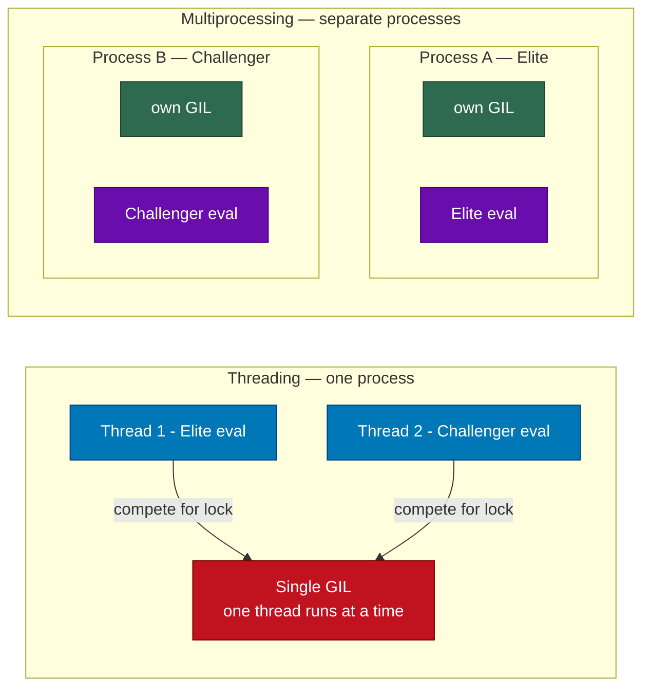
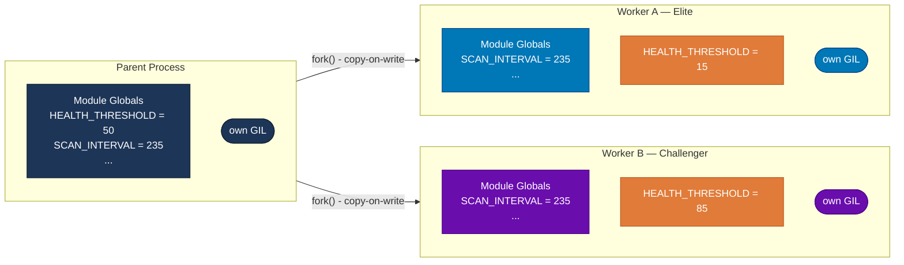

# Parallelism Design: Concurrent GA Evaluation

## Overview
The GA evaluates elite and challenger sequentially by default. This document covers why parallelism is needed, how Python's concurrency model works, what was tested, and how to implement concurrent evaluation.


## Why Parallelize
Each generation evaluates two genomes × 3 runs × ~10s/run = ~60s sequential. Running both evaluations concurrently cuts that to ~30s. On the spacecraft the two agents run on 2 separate physical cores, so parallelism also matches the intended hardware architecture.


## Background: Python's Concurrency Model

### The GIL (Global Interpreter Lock)
CPython (the standard Python interpreter) uses a lock called the GIL that only allows one thread to execute Python bytecode at a time. This means that even if you create multiple threads and have a multi-core CPU, pure Python code always serializes so you get concurrency (interleaving) but not true parallelism (simultaneous execution).

For CPU-bound work like running a game simulation, threading in Python gives you essentially no speedup. You'd be taking turns, not running in parallel.

### Why Threading Partially Works Here
VizDoom is a C++ engine, not pure Python. When Python calls into C++ code (like game.make_action()), the C++ code can explicitly release the GIL to let other Python threads run while it waits. VizDoom does this during its IPC round-trip. It blocks in C++ waiting for the game engine to process a tick via shared memory (shm_open / pthread_cond_wait). During that wait, the GIL is released and another thread's Python code can run.

This is why threading gives ~1.7x speedup rather than 1.0x. But it's still limited because the Python-side work (parsing game state, updating the agent) re-acquires the GIL and serializes.

### Multiprocessing: Bypass the GIL
multiprocessing spawns separate OS processes, each with their own Python interpreter and their own GIL. There is no shared GIL between processes; they are truly independent. This gives actual parallelism on multi-core hardware.

The tradeoff is that processes don't share memory. Passing data between them requires serialization (pickling in Python). For this use case, the data being passed in (a genome dict, ~200 bytes) and out (a stats dict, ~100 bytes) is tiny, so this cost is negligible.

### Threading vs Multiprocessing
Blue = threads/processes running eval, red = GIL bottleneck, green = independent GIL per process.




## Approach: ProcessPoolExecutor with Fork

`concurrent.futures.ProcessPoolExecutor` is the standard library's high-level wrapper around multiprocessing:
- `submit(fn, args)` sends work to a worker process and immediately returns a `Future` object
- `future.result()` blocks until the work is done and returns the value
- Submitting two tasks before calling `result()` on either means both run in parallel

```python
f_a = pool.submit(evaluate, elite)      # starts immediately in worker process
f_b = pool.submit(evaluate, challenger) # starts immediately in another worker process
a_result = f_a.result()                 # blocks until elite eval is done
b_result = f_b.result()                 # likely already done by the time we get here
```

### Fork vs Spawn
When creating a new worker process, the OS can either:
- **Fork:** copy the entire parent process memory into a new process instantly. Known as copy-on-write: pages are shared until one process writes to them, then copied.
- **Spawn:** start a fresh Python interpreter from scratch and re-import all modules

**Fork is ~0.4s faster per pool creation** because spawn must re-`dlopen` the VizDoom `.so` shared library in each new worker. On Linux, fork is the default and is safe for this project.

Fork is safe with VizDoom because each `DoomGame` instance creates its own child `vizdoom` binary via `fork+exec` and its own uniquely-named shared memory segments (`/dev/shm/ViZDoomSM<random_id>`). There is no shared mutable state between VizDoom instances at the C++ level.

### Benchmarks

| Method | 2 parallel evals wall time | Speedup vs sequential |
|--------|---------------------------|----------------------|
| Sequential | ~60s | 1.0x |
| ProcessPoolExecutor + fork | ~31s | ~1.95x |
| ProcessPoolExecutor + spawn | ~36s | ~1.65x |
| threading | ~35s | ~1.7x |


## Safety of Module-Level Patching
`_apply_params` in `agent.py` applies genome params by patching module-level globals in `state_machine` and `path_tracker` (e.g. `sm_mod.HEALTH_THRESHOLD = 50`). This works because of how fork's copy-on-write memory works:

When a process is forked, both parent and child initially share the same memory pages. The moment either process writes to a page, the OS gives that process its own private copy. So when a worker patches `sm_mod.HEALTH_THRESHOLD`, it writes to its own private copy of that memory and the other worker's copy stays unaffected. This means both workers can safely patch different genome values into the same module globals simultaneously with no interference.

### Process Memory After Fork
Navy = parent, teal = elite worker, purple = challenger worker. Orange = patched value. Each worker writes its own genome into its private copy of the module globals, with no effect on the other.




## Known Constraints

- **Stale shared memory:** VizDoom leaves `/dev/shm/ViZDoom*` files if a process is killed without `game.close()`. These don't conflict with new instances (random IDs) but accumulate over time. Ensure `game.close()` is called in exception handlers, and consider purging `/dev/shm/ViZDoom*` on startup.

- **Top-level worker function required:** `ProcessPoolExecutor` sends work to other processes by pickling the callable. Python can only pickle module-level functions (not instance methods or lambdas), so the worker function must be defined at module level, not as a method of `GeneticAlgo`.

- **Episode ID collision:** Each worker process starts `episode_count` at 0, so both would write `ep_0000_summary.json`, `ep_0001_summary.json`, etc. to the same directory. Fix by passing an episode ID offset. For example, elite worker starts at 0 and challenger worker starts at 10000.


## Implementation Plan

```python
import multiprocessing as mp
from concurrent.futures import ProcessPoolExecutor

#Must be module-level (not a method) so it can be pickled and sent to worker processes
def _eval_worker(args: tuple) -> tuple[float, bool]:
    genome, map_name, episode_offset = args
    agent = Agent()
    agent.initialize_game(headless=True, evolve=True, map_name=map_name)
    agent.episode_count = episode_offset
    fitnesses = []
    any_completed = False
    for _ in range(EVAL_RUNS):
        stats = agent.run_episode(genome=genome, full_telemetry=False)
        fitness = compute_fitness(stats)
        stats["fitness"] = fitness
        agent.telemetry_writer.finalize_episode(stats)
        fitnesses.append(fitness)
        if stats.get("finish_level"):
            any_completed = True
    agent.close()
    return round(sum(fitnesses) / len(fitnesses), 2), any_completed


class GeneticAlgo:

    def __init__(self) -> None:
        #Pool created once, persists across all generations and levels
        #fork context: workers inherit the parent process state without re-importing modules
        self._pool = ProcessPoolExecutor(
            max_workers=2,
            mp_context=mp.get_context("fork")
        )

    def _evaluate_parallel(self, elite, challenger, level) -> tuple:
        #Submit both simultaneously. They run in parallel in separate processes.
        #Episode offsets of 0 and 10000 prevent telemetry filename collisions.
        f_a = self._pool.submit(_eval_worker, (elite, level, 0))
        f_b = self._pool.submit(_eval_worker, (challenger, level, 10000))
        return f_a.result(), f_b.result()

    def evolve(self) -> None:
        ...
        #Replace the two sequential _evaluate calls with one parallel call:
        (a_fit, a_beat), (b_fit, b_beat) = self._evaluate_parallel(elite, challenger, level)
        ...
```

The pool is created once in `__init__` and reused across all generations and levels. Workers initialize their own `Agent` per call, which adds ~1-2s startup overhead per eval but keeps workers stateless and avoids stale game state carrying over between levels.