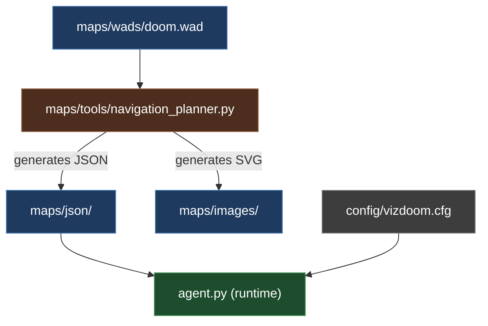
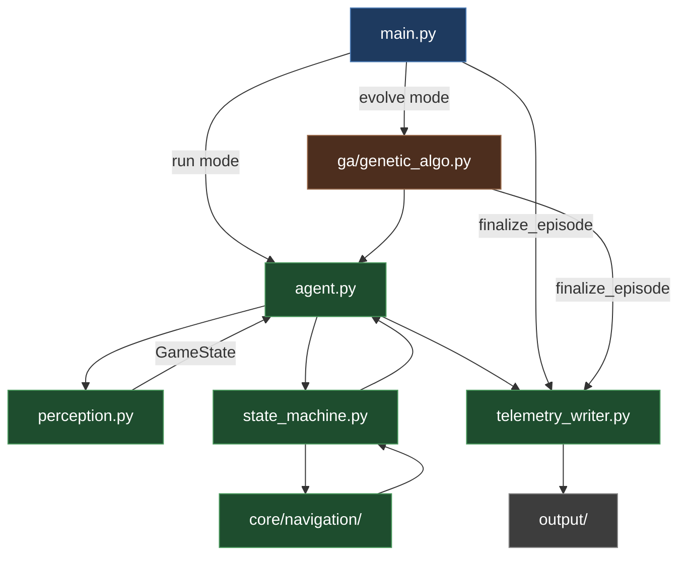

# DoomSat System Design

## Overview

This doc covers the full system execution flow: how offline tools prepare map data, how main.py drives run and evolve modes, and how the runtime classes interact each tick. For class-level details (fields, methods, responsibilities) see `class_reference.md`. For telemetry output schemas see `telemetry.md`. For GA algorithm details see `genetic_algo_design.md`.

The runtime is split into two sides with a clean boundary. The Agent side handles the episode lifecycle: initializing VizDoom, running the game loop, and parsing raw game state into a GameState dataclass via Perception. Agent makes no decisions. The StateMachine side owns all decision-making: StateMachine reads GameState each tick and returns an action, delegating navigation to NavigationEngine (pure A* pathfinding and movement) and mission progress to PathTracker (node graph management, loot node placement, waypoint tracking). The boundary between the two sides is GameState flowing in and an action vector flowing out.

In run mode, main.py drives a single episode directly through Agent. In evolve mode, main.py delegates to GeneticAlgo, which owns the Agent and manages the full evolution loop. In both modes, the runner computes fitness and calls telemetry_writer.finalize_episode() after run_episode() returns.

## Execution Flow

1. main.py calls agent.initialize_game(). Agent creates VizDoom game object, loads config, creates Graph (static nodes from JSON), creates NavigationEngine and PathTracker with Graph reference, creates StateMachine with PathTracker, creates Perception.
2. main.py calls agent.run_episode(params). Agent seeds RNG, calls game.new_episode(), opens telemetry files. Loop starts.
3. Game tick fires. Agent calls perception.parse(game.get_state()) -> GameState.
4. Agent calls state_machine.update(gamestate). StateMachine checks priority: stats above thresholds, no enemies, no damage taken -> stay in TRAVERSE state.
5. StateMachine calls path_tracker.update(game_state). PathTracker checks loot_visible, runs duplicate check, places waypoint + loot nodes if needed, advances last_node and next_node if node reached.
6. StateMachine calls path_tracker.get_next_move(current_position). PathTracker calls NavigationEngine internally -> returns action.
7. StateMachine returns action to Agent. Agent calls game.make_action(action) and telemetry_writer.record_step(). Loop continues.
8. game.is_episode_finished() -> True. Agent returns raw stats to runner.
9. Runner (main.py or GeneticAlgo) calls compute_fitness(stats) then agent.telemetry_writer.finalize_episode(stats).

**Runtime Sequence Diagram:**

```mermaid
sequenceDiagram
    participant M as main.py
    participant A as Agent
    participant P as Perception
    participant SM as StateMachine
    participant PT as PathTracker

    rect rgb(30, 58, 95)
        M->>A: initialize_game()
        A->>PT: load_static_nodes()
        M->>A: run_episode(params)
        A->>A: game.new_episode()
    end

    loop each tick
        rect rgb(30, 77, 46)
            A->>P: parse(game.get_state())
            P-->>A: GameState
            A->>SM: update(GameState)
            SM->>PT: update(GameState)
            SM->>PT: get_next_move()
            PT-->>SM: action
            SM-->>A: action
            A->>A: game.make_action(action)
        end
    end

    rect rgb(77, 46, 30)
        A-->>M: stats
        M->>M: compute_fitness(stats)
        M->>A: telemetry_writer.finalize_episode(stats)
    end
```

**File Interactions: Offline Setup:**

**File Interactions: Runtime:**
